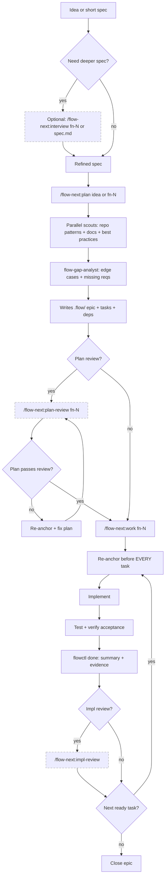

<div align="center">

# Flow-Next (OpenCode)

[](./CHANGELOG.md)
[](./CHANGELOG.md)

**Plan first, work second. OpenCode-native port of Flow-Next.**

**Upstream (Claude Code):** https://github.com/gmickel/gmickel-claude-marketplace/tree/main/plugins/flow-next

</div>

---

> **Experimental.** Active work-in-progress while we chase parity with upstream. **Ralph mode is now available (experimental).**

Ralph docs: `docs/ralph.md`

---

🌐 **Prefer a visual overview?** See the [Flow-Next app page](https://mickel.tech/apps/flow-next) for diagrams and examples.

---

> ### ⚠️ RepoPrompt 1.6.0+ Required
>
> If you use the **RepoPrompt (rp) backend** for `/flow-next:impl-review`, upgrade to **RepoPrompt 1.6.0+**.
>
> Check your version: `rp-cli --version`
>
> The new builder review mode provides better context discovery and more focused reviews. If you can't upgrade yet, use `--review=opencode` or `--review=none` as alternatives.

---

## Table of Contents

- [What Is This?](#what-is-this)
- [Epic-first Task Model](#epic-first-task-model)
- [Why It Works](#why-it-works)
- [Quick Start](#quick-start) — Install, setup, use
- [When to Use What](#when-to-use-what) — Interview vs Plan vs Work
- [Agent Readiness Assessment](#agent-readiness-assessment) — `/flow-next:prime`
- [Human-in-the-Loop Workflow (Detailed)](#human-in-the-loop-workflow-detailed)
- [Commands](#commands) — All slash commands + flags
  - [Command Reference](#command-reference)
- [The Workflow](#the-workflow) — Planning and work phases
- [Ralph Mode (Autonomous, Opt-In)](#ralph-mode-autonomous-opt-in)
- [Features](#features) — Re-anchoring, multi-user, reviews, dependencies
- [Memory System (Opt-in)](#memory-system-opt-in)
- [Ralph (Autonomous Mode)](#ralph-autonomous-mode)
- [Task Completion](#task-completion)
- [.flow/ Directory](#flow-directory) — File structure
- [flowctl CLI](#flowctl-cli) — Direct CLI usage
- [Troubleshooting](#troubleshooting)
- [Flow vs Flow-Next](#flow-vs-flow-next)
- [Requirements](#requirements)
- [Development](#development)
- [Other Platforms](#other-platforms)
- [Uninstall](#uninstall)

---

## What Is This?

Flow-Next is a plan-first orchestration system: epics, dependency-ordered tasks, re-anchoring, reviews, and audit trails. Everything lives in your repo. No external services. Uninstall by deleting `.flow/` (and `scripts/ralph/` if enabled).

This repo is a **native OpenCode port** of the original Claude Code plugin.

<table>
<tr>
<td></td>
<td></td>
</tr>
<tr>
<td align="center"><em>Planning: dependency-ordered tasks</em></td>
<td align="center"><em>Execution: fixes, evidence, review</em></td>
</tr>
</table>

---

## Epic-first Task Model

Flow-Next does not support standalone tasks. Every unit of work belongs to an epic `fn-N` (even if it’s a single task). Tasks are `fn-N.M` and inherit context from the epic spec.

Rationale: keeps the system simple, improves re-anchoring, and makes automation reliable.

---

## Why It Works

### You Control the Granularity

Work task-by-task with review after each, or run an entire epic at once. Same guarantees either way.

```bash
# One task at a time (review after each)
/flow-next:work fn-1.1

# Entire epic (review after all tasks complete)
/flow-next:work fn-1
```

### No Context Length Worries

* **Tasks sized at planning** so each fits one `/flow-next:work`
* **Re-anchor every task** from `.flow/` before any implementation
* **Survives compaction** because the source of truth is on disk

### Reviewer as Safety Net

If drift happens, a second model catches it before it compounds:

1. Implement task
2. Review via OpenCode or RepoPrompt
3. Fix → re-review until `<verdict>SHIP</verdict>`

### Zero Friction

* **Works in under a minute**: install, run a command
* **Non-invasive**: no daemons, no external services
* **Clean uninstall**: delete `.flow/` (and `scripts/ralph/` if enabled)

---

## Quick Start

### 1) Install (project-local)

From this repo:

```bash
./install.sh --project /path/to/your/project
```

Notes:
* Installs `.opencode/` into the project
* Only writes `.opencode/opencode.json` if the project doesn’t already have one

### 2) Setup

Open your project in OpenCode and run:

```bash
/flow-next:setup
```

This:
* Copies `flowctl` to `.flow/bin/`
* Adds flow-next instructions to `AGENTS.md`
* Creates `.flow/usage.md` CLI reference
* Tracks setup version for updates

After setup:

```bash
export PATH=".flow/bin:$PATH"
flowctl epics
flowctl tasks --epic fn-1
flowctl ready --epic fn-1
```

### 3) Use

```bash
/flow-next:plan Add a contact form with validation
/flow-next:work fn-1
```

### When to Use What

Flow-Next is flexible. There’s no single “correct” order — the right sequence depends on how well-defined your spec already is.

**The key question: How fleshed out is your idea?**

#### Vague idea or rough concept

```
Interview → Plan → Work
```

1. **Interview first** — `/flow-next:interview "your rough idea"` asks deep questions to surface requirements, edge cases, and decisions you haven’t thought about
2. **Plan** — `/flow-next:plan fn-1` researches best practices, current docs, repo patterns, scans open epics for dependencies, flags doc updates, then splits into properly-sized tasks
3. **Work** — `/flow-next:work fn-1` executes with re-anchoring and reviews

#### Well-written spec or PRD

```
Plan → Interview → Work
```

1. **Plan first** — `/flow-next:plan specs/my-feature.md` researches best practices, current patterns, epic dependencies, and doc updates, then breaks your spec into epic + tasks
2. **Interview after** — `/flow-next:interview fn-1` runs deep questions against the plan to catch edge cases, missing requirements, or assumptions
3. **Work** — `/flow-next:work fn-1` executes

#### Minimal planning

```
Plan → Work
```

Skip interview entirely for well-understood changes. Plan still researches best practices and splits into tasks.

#### Quick single-task (spec already complete)

```
Work directly
```

```bash
/flow-next:work specs/small-fix.md
```

For small, self-contained changes where you already have a complete spec. Creates an epic with **one task** and executes immediately. You get flow tracking, re-anchoring, and optional review — without full planning overhead.

Best for: bug fixes, small features, well-scoped changes that don’t need task splitting.

**Note:** This does NOT split into multiple tasks. For detailed specs that need breakdown, use Plan first.

**Summary:**

| Starting point | Recommended sequence |
|----------------|---------------------|
| Vague idea, rough notes | Interview → Plan → Work |
| Detailed spec/PRD | Plan → Interview → Work |
| Well-understood, needs task splitting | Plan → Work |
| Small single-task, spec complete | Work directly (creates 1 epic + 1 task) |

You can always run interview again after planning to catch anything missed. Interview writes back to the spec, so iterations refine rather than replace.

---

### Interactive vs Autonomous (The Handoff)

After planning completes, choose how to execute:

| Mode | Command | When to Use |
|------|---------|-------------|
| **Interactive** | `/flow-next:work fn-1` | Complex tasks, learning a codebase, taste matters, want to intervene |
| **Autonomous (Ralph)** | `scripts/ralph/ralph.sh` | Clear specs, bulk implementation, overnight runs |

**Heuristic:** If you can write checkboxes, you can Ralph it. If you can’t, you’re not ready to loop—you're ready to think.

For full autonomous mode, prepare 5–10 plans before starting Ralph. See [Ralph Mode](#ralph-autonomous-mode) for setup.

> 📖 Deep dive: [Ralph Mode: Why AI Agents Should Forget](https://medium.com/byte-sized-brainwaves/ralph-mode-why-ai-agents-should-forget-9f98bec6fc91)

---

## Agent Readiness Assessment

> Inspired by [Factory.ai's Agent Readiness framework](https://factory.ai/news/agent-readiness)

`/flow-next:prime` assesses your codebase for agent-readiness and proposes improvements. Works for greenfield and brownfield projects.

### The Problem

Agents waste cycles when codebases lack:
- **Pre-commit hooks** → waits 10min for CI instead of 5sec local feedback
- **Documented env vars** → guesses, fails, guesses again
- **CLAUDE.md** → doesn't know project conventions
- **Test commands** → can't verify changes work

These are **environment problems**, not agent problems. Prime helps fix them.

### Quick Start

```bash
/flow-next:prime                 # Full assessment + interactive fixes
/flow-next:prime --report-only   # Just show the report
/flow-next:prime --fix-all       # Apply all fixes without asking
```

### The Eight Pillars

Prime evaluates your codebase across eight pillars (48 criteria total):

#### Agent Readiness (Pillars 1-5) — Scored, Fixes Offered

| Pillar | What It Checks |
|--------|----------------|
| **1. Style & Validation** | Linters, formatters, type checking, pre-commit hooks |
| **2. Build System** | Build tool, commands, lock files, monorepo tooling |
| **3. Testing** | Test framework, commands, verification, coverage, E2E |
| **4. Documentation** | README, CLAUDE.md, setup docs, architecture |
| **5. Dev Environment** | .env.example, Docker, devcontainer, runtime version |

#### Production Readiness (Pillars 6-8) — Reported Only

| Pillar | What It Checks |
|--------|----------------|
| **6. Observability** | Structured logging, tracing, metrics, error tracking, health endpoints |
| **7. Security** | Branch protection, secret scanning, CODEOWNERS, Dependabot |
| **8. Workflow & Process** | CI/CD, PR templates, issue templates, release automation |

**Two-tier approach**: Pillars 1-5 determine your agent maturity level and are eligible for fixes. Pillars 6-8 are reported for visibility but no fixes are offered — these are team/production decisions.

### Maturity Levels

| Level | Name | Description | Overall Score |
|-------|------|-------------|---------------|
| 1 | Minimal | Basic project structure only | <30% |
| 2 | Functional | Can build and run, limited docs | 30-49% |
| 3 | **Standardized** | Agent-ready for routine work | 50-69% |
| 4 | Optimized | Fast feedback loops, comprehensive docs | 70-84% |
| 5 | Autonomous | Full autonomous operation capable | 85%+ |

**Level 3 is the target** for most teams. It means agents can handle routine work: bug fixes, tests, docs, dependency updates.

### How It Works

1. **Parallel Assessment** — 9 scouts run in parallel (~15-20 seconds)
2. **Verification** — Verifies test commands actually work (e.g., `pytest --collect-only`)
3. **Synthesize Report** — Calculates Agent Readiness score, Production Readiness score, maturity level
4. **Interactive Remediation** — Uses `AskUserQuestion` for agent readiness fixes only
5. **Apply Fixes** — Creates/modifies files based on your selections
6. **Re-assess** — Optionally re-run to show improvement

### Example Report

```markdown
# Agent Readiness Report

**Repository**: my-project
**Assessed**: 2026-01-23

## Scores Summary

| Category | Score | Level |
|----------|-------|-------|
| **Agent Readiness** (Pillars 1-5) | 73% | Level 4 - Optimized |
| Production Readiness (Pillars 6-8) | 17% | — |
| **Overall** | 52% | — |

## Agent Readiness (Pillars 1-5)

| Pillar | Score | Status |
|--------|-------|--------|
| Style & Validation | 67% (4/6) | ⚠️ |
| Build System | 100% (6/6) | ✅ |
| Testing | 67% (4/6) | ⚠️ |
| Documentation | 83% (5/6) | ✅ |
| Dev Environment | 83% (5/6) | ✅ |

## Production Readiness (Pillars 6-8) — Report Only

| Pillar | Score | Status |
|--------|-------|--------|
| Observability | 33% (2/6) | ❌ |
| Security | 17% (1/6) | ❌ |
| Workflow & Process | 0% (0/6) | ❌ |

## Top Recommendations (Agent Readiness)

1. **Tooling**: Add pre-commit hooks — 5 sec feedback vs 10 min CI wait
2. **Tooling**: Add Python type checking — catch errors locally
3. **Docs**: Update README — replace generic template
```

### Remediation Templates

Prime offers fixes for agent readiness gaps (**not** team governance):

| Fix | What Gets Created |
|-----|-------------------|
| CLAUDE.md | Project overview, commands, structure, conventions |
| .env.example | Template with detected env vars |
| Pre-commit (JS) | Husky + lint-staged config |
| Pre-commit (Python) | `.pre-commit-config.yaml` |
| Linter config | ESLint, Biome, or Ruff config (if none exists) |
| Formatter config | Prettier or Biome config (if none exists) |
| .nvmrc/.python-version | Runtime version pinning |
| .gitignore entries | .env, build outputs, node_modules |

Templates adapt to your project's detected conventions and existing tools. Won't suggest ESLint if you have Biome, etc.

### User Consent Required

**By default, prime asks before every change** using interactive checkboxes. You choose what gets created.

- **Asks first** — uses `AskUserQuestion` tool for interactive selection per category
- **Never overwrites** existing files without explicit consent
- **Never commits** changes (leaves for you to review)
- **Never deletes** files
- **Merges** with existing configs when possible
- **Respects** your existing tools (won't add ESLint if you have Biome)

Use `--fix-all` to skip questions and apply everything. Use `--report-only` to just see the assessment.

### Flags

| Flag | Description |
|------|-------------|
| `--report-only` | Skip remediation, just show report |
| `--fix-all` | Apply all recommendations without asking |
| `<path>` | Assess a different directory |

---

## Human-in-the-Loop Workflow (Detailed)



---

## Commands

| Command | What It Does |
|---------|--------------|
| `/flow-next:plan <idea>` | Research codebase, create epic with dependency-ordered tasks |
| `/flow-next:work <id|file>` | Execute epic, task, or spec file, re-anchoring before each |
| `/flow-next:interview <id>` | Deep interview to flesh out a spec before planning |
| `/flow-next:plan-review <id>` | Carmack-level plan review via OpenCode or RepoPrompt |
| `/flow-next:prime` | Assess codebase agent-readiness, propose fixes |
| `/flow-next:impl-review` | Carmack-level impl review of current branch |
| `/flow-next:sync <id>` | Manually sync downstream specs after implementation drift |
| `/flow-next:ralph-init` | Scaffold repo-local Ralph harness ( `scripts/ralph/` ) |
| `/flow-next:setup` | Install flowctl locally + add docs |
| `/flow-next:uninstall` | Remove flow-next from project (keeps tasks if desired) |
| `/flow-next:export-context` | Export RepoPrompt context for external LLMs |

Work accepts an epic ( `fn-N` ), task ( `fn-N.M` ), or markdown spec file ( `.md` ). Spec files auto-create an epic with one task.

### Flags (skip questions)

```bash
/flow-next:plan Add caching --research=grep --no-review
/flow-next:plan Add auth --research=rp --review=rp

/flow-next:prime --report-only
/flow-next:prime --fix-all

/flow-next:work fn-1 --branch=current --no-review
/flow-next:work fn-1 --branch=new --review=opencode

/flow-next:plan-review fn-1 --review=rp
/flow-next:impl-review --review=opencode
```

Natural language also works:

```bash
/flow-next:plan Add webhooks, use context-scout, skip review
/flow-next:work fn-1 current branch, no review
```

| Command | Available Flags |
|---------|-----------------|
| `/flow-next:plan` | `--research=rp|grep` , `--review=opencode|rp|export|none` , `--no-review` |
| `/flow-next:work` | `--branch=current|new|worktree` , `--review=opencode|rp|export|none` , `--no-review` |
| `/flow-next:plan-review` | `--review=opencode|rp|export` |
| `/flow-next:impl-review` | `--review=opencode|rp|export` |
| `/flow-next:prime` | `--report-only`, `--fix-all` |

---

### Command Reference

Detailed input documentation for each command.

#### `/flow-next:plan`

```
/flow-next:plan <idea or fn-N> [--research=rp|grep] [--review=opencode|rp|export|none]
```

| Input | Description |
|-------|-------------|
| `<idea>` | Free-form feature description ("Add user authentication with OAuth") |
| `fn-N` | Existing epic ID to update the plan |
| `--research=rp` | Use RepoPrompt context-scout for deeper codebase discovery |
| `--research=grep` | Use grep-based repo-scout (default, faster) |
| `--review=opencode\|rp\|export\|none` | Review backend after planning |
| `--no-review` | Shorthand for `--review=none` |

#### `/flow-next:work`

```
/flow-next:work <id|file> [--branch=current|new|worktree] [--review=opencode|rp|export|none]
```

| Input | Description |
|-------|-------------|
| `fn-N` | Execute entire epic (all tasks in dependency order) |
| `fn-N.M` | Execute single task |
| `path/to/spec.md` | Create epic from spec file, execute immediately |
| `--branch=current` | Work on current branch |
| `--branch=new` | Create new branch `fn-N-slug` (default) |
| `--branch=worktree` | Create git worktree for isolated work |
| `--review=opencode\|rp\|export\|none` | Review backend after work |
| `--no-review` | Shorthand for `--review=none` |

#### `/flow-next:interview`

```
/flow-next:interview <id|file>
```

| Input | Description |
|-------|-------------|
| `fn-N` | Interview about epic to refine requirements |
| `fn-N.M` | Interview about specific task |
| `path/to/spec.md` | Interview about spec file |
| `"rough idea"` | Interview about a new idea (creates epic) |

Deep questioning (40+ questions) to surface requirements, edge cases, and decisions.

#### `/flow-next:plan-review`

```
/flow-next:plan-review <fn-N> [--review=opencode|rp|export] [focus areas]
```

| Input | Description |
|-------|-------------|
| `fn-N` | Epic ID to review |
| `--review=opencode` | Use OpenCode (cross-platform) |
| `--review=rp` | Use RepoPrompt (macOS, visual builder) |
| `--review=export` | Export context for manual review |
| `[focus areas]` | Optional: "focus on security" or "check API design" |

Carmack-level criteria: Completeness, Feasibility, Clarity, Architecture, Risks, Scope, Testability.

#### `/flow-next:impl-review`

```
/flow-next:impl-review [--review=opencode|rp|export] [focus areas]
```

| Input | Description |
|-------|-------------|
| `--review=opencode` | Use OpenCode (cross-platform) |
| `--review=rp` | Use RepoPrompt (macOS, visual builder) |
| `--review=export` | Export context for manual review |
| `[focus areas]` | Optional: "focus on performance" or "check error handling" |

Reviews current branch changes. Carmack-level criteria: Correctness, Simplicity, DRY, Architecture, Edge Cases, Tests, Security.

#### `/flow-next:prime`

```
/flow-next:prime [--report-only] [--fix-all] [path]
```

| Input | Description |
|-------|-------------|
| (no args) | Assess current directory, interactive fixes |
| `--report-only` | Show assessment report, skip remediation |
| `--fix-all` | Apply all recommendations without asking |
| `[path]` | Assess a different directory |

See [Agent Readiness Assessment](#agent-readiness-assessment) for details.

#### `/flow-next:sync`

```
/flow-next:sync <id> [--dry-run]
```

| Input | Description |
|-------|-------------|
| `fn-N` | Sync entire epic's downstream tasks |
| `fn-N.M` | Sync from specific task |
| `--dry-run` | Preview changes without writing |

Updates downstream task specs when implementation drifts from plan.

#### `/flow-next:ralph-init`

```
/flow-next:ralph-init
```

No arguments. Scaffolds `scripts/ralph/` for autonomous operation.

#### `/flow-next:setup`

```
/flow-next:setup
```

No arguments. Optional setup that:
- Configures review backend (rp, opencode, or none)
- Copies flowctl to `.flow/bin/`
- Adds flow-next instructions to `AGENTS.md`

#### `/flow-next:uninstall`

```
/flow-next:uninstall
```

No arguments. Interactive removal with option to keep tasks.

---

## The Workflow

### Defaults (manual and Ralph)

Flow-Next uses the same defaults in manual and Ralph runs. Ralph bypasses prompts only.

- plan: `--research=grep`
- work: `--branch=new`
- review: from `.flow/config.json` (set via `/flow-next:setup`), or `none` if not configured

Override via flags or `scripts/ralph/config.env`.

### Planning Phase

1. **Research (parallel subagents)**: `repo-scout` (or `context-scout` if rp-cli) + `practice-scout` + `docs-scout` + `github-scout` + `epic-scout` + `docs-gap-scout`
2. **Gap analysis**: `flow-gap-analyst` finds edge cases + missing requirements
3. **Epic creation**: Writes spec to `.flow/specs/fn-N.md`, sets epic dependencies from `epic-scout` findings
4. **Task breakdown**: Creates tasks + explicit dependencies in `.flow/tasks/`, adds doc update acceptance criteria from `docs-gap-scout`
5. **Validate**: `flowctl validate --epic fn-N`
6. **Review** (optional): `/flow-next:plan-review fn-N` with re-anchor + fix loop until "Ship"

### Work Phase

1. **Re-anchor**: Re-read epic + task specs + git state (EVERY task)
2. **Execute**: Implement using existing patterns
3. **Test**: Verify acceptance criteria
4. **Record**: `flowctl done` adds summary + evidence to the task spec
5. **Review** (optional): `/flow-next:impl-review` via OpenCode or RepoPrompt
6. **Loop**: Next ready task → repeat until no ready tasks. Close epic manually (`flowctl epic close fn-N`) or let Ralph close at loop end.

---

## Ralph Mode (Autonomous, Opt-In)

Ralph is repo-local and opt-in. Files are created only by `/flow-next:ralph-init`. Remove with `rm -rf scripts/ralph/`.
`/flow-next:ralph-init` also writes `scripts/ralph/.gitignore` so run logs stay out of git.

What it automates (one unit per iteration, fresh context each time):
- Selector chooses plan vs work unit (`flowctl next`)
- Plan gate = plan review loop until Ship (if enabled)
- Work gate = one task until pass (tests + validate + optional impl review)
- Single run branch: all epics work on one `ralph-<run-id>` branch (cherry-pick/revert friendly)

Enable:
```bash
/flow-next:ralph-init
./scripts/ralph/ralph_once.sh   # one iteration (observe)
./scripts/ralph/ralph.sh        # full loop (AFK)
```

**Watch mode** - see what OpenCode is doing:
```bash
./scripts/ralph/ralph.sh --watch           # Stream tool calls in real-time
./scripts/ralph/ralph.sh --watch verbose   # Also stream model responses
```

Run scripts from terminal (not inside OpenCode). `ralph_once.sh` runs one iteration so you can observe before going fully autonomous.

### Ralph defaults vs recommended (plan review gate)

`REQUIRE_PLAN_REVIEW` controls whether Ralph must pass the **plan review gate** before doing any implementation work.

**Default (safe, won't stall):**

* `REQUIRE_PLAN_REVIEW=0`
  Ralph can proceed to work tasks even if `rp-cli` is missing or unavailable overnight.

**Recommended (strict, slows down):**

* `REQUIRE_PLAN_REVIEW=1`
  Ralph won't start any task work until the plan review passes.

---

## Features

### Re-anchoring prevents drift

Before EVERY task, Flow-Next re-reads:
* Epic spec and task spec from `.flow/`
* Current git status and recent commits
* Validation state

### Multi-user Safe

Teams can work in parallel branches without coordination servers:

* **Merge-safe IDs**: Scans existing files to allocate the next ID
* **Soft claims**: Tasks track an `assignee` field
* **Actor resolution**: Auto-detects from git email,  `FLOW_ACTOR` env, or `$USER`
* **Local validation**: `flowctl validate --all` catches issues before commit

### Parallel Worktrees

Multiple agents can work simultaneously in different git worktrees, sharing task state:

```bash
# Main repo
git worktree add ../feature-a fn-1-branch
git worktree add ../feature-b fn-2-branch

# Both worktrees share task state via .git/flow-state/
cd ../feature-a && flowctl start fn-1.1   # Agent A claims task
cd ../feature-b && flowctl start fn-2.1   # Agent B claims different task
```

**How it works:**
- Runtime state (status, assignee, evidence) lives in `.git/flow-state/` — shared across worktrees
- Definition files (title, description, deps) stay in `.flow/` — tracked in git
- Per-task `fcntl` locking prevents race conditions

**State directory resolution:**
1. `FLOW_STATE_DIR` env (explicit override)
2. `git --git-common-dir` + `/flow-state` (worktree-aware)
3. `.flow/state` fallback (non-git or old git)

**Commands:**
```bash
flowctl state-path                # Show resolved state directory
flowctl migrate-state             # Migrate existing repo (optional)
flowctl migrate-state --clean     # Migrate + remove runtime from tracked files
```

**Backward compatible** — existing repos work without migration. The merged read path automatically falls back to definition files when no state file exists.

### Zero Dependencies

Everything is bundled:
* `flowctl.py` ships with the plugin
* No external tracker CLI to install
* No external services
* Just Python 3

### Non-invasive

* No daemons
* No global config
* Delete `.flow/` to uninstall; if you enabled Ralph, also delete `scripts/ralph/`

### CI-ready

```bash
flowctl validate --all
```

### Fresh Context Per Task (Worker Agent)

When running `/flow-next:work` on an epic, each task spawns a dedicated worker subagent with fresh context. This prevents context bloat across large epics and ensures clean re-anchoring.

### Plan-Sync (Spec Drift Detection)

When implementation differs from spec (e.g., you planned `UserAuth.login()` but built `authService.authenticate()`), downstream tasks may reference stale APIs.

Plan-sync detects this drift and updates downstream specs:

```bash
# After completing a task, sync downstream specs
/flow-next:sync fn-1.1

# Or sync entire epic from most recent done task
/flow-next:sync fn-1

# Dry-run to see what would change
/flow-next:sync fn-1 --dry-run
```

Enable auto-sync after each task (optional):
```bash
flowctl config set planSync.enabled true
```

Optional cross-epic sync (off by default):
```bash
flowctl config set planSync.crossEpic true
```

### Dependency Graphs

Tasks declare blockers; `flowctl ready` shows what can start. Nothing executes until dependencies resolve.

### One File Per Task

Each epic and task gets its own JSON + markdown pair. Merge conflicts are rare and easy to resolve.

### Cross-Model Reviews

Two models catch what one misses. Reviews use a second model (OpenCode or RepoPrompt) to verify plans and implementations before they ship.

**Review criteria:**

| Review Type | Criteria |
|-------------|----------|
| **Plan** | Completeness, Feasibility, Clarity, Architecture, Risks (incl. security), Scope, Testability |
| **Impl** | Correctness, Simplicity, DRY, Architecture, Edge Cases, Tests, Security |

Reviews block progress until `<verdict>SHIP</verdict>` . Fix → re-review cycles continue until approved.

#### OpenCode (Default)

OpenCode uses a dedicated review subagent configured in `.opencode/opencode.json` :
* `model: openai/gpt-5.2`
* `reasoningEffort: high`

Change those if you want a different model or effort.

#### RepoPrompt (Optional)

[RepoPrompt](https://repoprompt.com/?atp=KJbuL4) provides the best review experience on macOS.

**Requires RepoPrompt 1.6.0+** for the rp review backend (builder review mode). Older versions will fail — upgrade if using rp.

**Why use RepoPrompt:**
* Best-in-class context builder for reviews (full file context, smart selection)
* Optional: enables the planning **context-scout** for deeper discovery vs repo-scout
* Visual diff review UI + persistent chat threads

**Setup:**

```bash
brew install --cask repoprompt
```

**Usage:**

```bash
/flow-next:plan-review fn-1 --review=rp
/flow-next:impl-review --review=rp
```

#### Configuration

Set default review backend:

```bash
# Per-project (saved in .flow/config.json)
flowctl config set review.backend opencode   # or rp, or none

# Per-session (environment variable)
export FLOW_REVIEW_BACKEND=opencode
```

Priority: `--review=...` argument > `FLOW_REVIEW_BACKEND` env > `.flow/config.json` > auto-detect.

#### Export (External LLM)

If you want to use an external model, run reviews with `--review=export` and use `/flow-next:export-context` to generate a clean prompt + file bundle for pasting into another tool.

---

## Memory System (Opt-in)

Persistent learnings that survive context compaction.

```bash
# Enable
flowctl config set memory.enabled true
flowctl memory init

# Manual entries
flowctl memory add --type pitfall "Always use flowctl rp wrappers"
flowctl memory add --type convention "Tests in __tests__ dirs"
flowctl memory add --type decision "SQLite over Postgres for simplicity"

# Query
flowctl memory list
flowctl memory search "flowctl"
flowctl memory read --type pitfalls
```

When enabled:
* **Planning**: `memory-scout` runs in parallel with other scouts
* **Work**: `memory-scout` retrieves relevant entries during re-anchor

Config lives in `.flow/config.json` , separate from Ralph’s `scripts/ralph/config.env` .

---

## Ralph (Autonomous Mode)

Ralph automation is available ( `/flow-next:ralph-init` ). Docs live at `docs/ralph.md` (setup, `config.env`, `.opencode/opencode.json`, logs).

### Controlling Ralph

```bash
flowctl status
flowctl ralph pause
flowctl ralph resume
flowctl ralph stop
```

Manual sentinels:
```bash
touch scripts/ralph/runs/<run-id>/PAUSE
rm scripts/ralph/runs/<run-id>/PAUSE
touch scripts/ralph/runs/<run-id>/STOP
```

---

## Task Completion

When a task completes, `flowctl done` appends structured data to the task spec:

### Done Summary

```markdown

## Done summary

- Added ContactForm component with Zod validation
- Integrated with server action for submission
- All tests passing

Follow-ups:
- Consider rate limiting (out of scope)
```

### Evidence

```markdown

## Evidence

- Commits: a3f21b9
- Tests: bun test
- PRs:
```

This creates a complete audit trail: what was planned, what was done, how it was verified.

---

## .flow/ Directory

```
.flow/
├── meta.json
├── config.json
├── epics/
│   └── fn-1-abc.json
├── specs/
│   └── fn-1-abc.md
├── tasks/
│   ├── fn-1-abc.1.json
│   ├── fn-1-abc.1.md
│   └── ...
└── memory/
    ├── pitfalls.md
    ├── conventions.md
    └── decisions.md
```

Runtime state (status, assignee, evidence) is stored in `.git/flow-state/` (not tracked).

### ID Format

* **Epic**: `fn-N-xxx` where `xxx` is a 3-character alphanumeric suffix
* **Task**: `fn-N-xxx.M`

Legacy `fn-N` format is still supported for backwards compatibility.

---

## flowctl CLI

Bundled Python script for managing `.flow/`. Flow-Next’s commands handle epic/task creation automatically—use `flowctl` for direct inspection, fixes, or advanced workflows.

```bash
flowctl init
flowctl detect

flowctl epic create --title "..."
flowctl epic set-plan fn-1 --file spec.md
flowctl epic set-plan-review-status fn-1 --status ship
flowctl epic close fn-1

flowctl task create --epic fn-1 --title "..." --deps fn-1.2,fn-1.3 --priority 10
flowctl task set-description fn-1.1 --file desc.md
flowctl task set-acceptance fn-1.1 --file accept.md
flowctl task set-spec fn-1.1 --file spec.md

flowctl dep add fn-1.3 fn-1.2

flowctl ready --epic fn-1
flowctl next
flowctl start fn-1.1
flowctl done fn-1.1 --summary-file s.md --evidence-json e.json
flowctl block fn-1.2 --reason-file r.md

flowctl show fn-1 --json
flowctl cat fn-1

flowctl validate --epic fn-1
flowctl validate --all

flowctl state-path
flowctl migrate-state --clean

flowctl review-backend            # Get configured review backend (ASK if not set)
flowctl config set review.backend opencode  # Set default backend
```

📖 **[Full CLI reference](docs/flowctl.md)**

---

## Troubleshooting

### Reset a stuck task

```bash
# Check task status
flowctl show fn-1.2 --json

# Reset to todo (from done/blocked)
flowctl task reset fn-1.2

# Reset + dependents in same epic
flowctl task reset fn-1.2 --cascade
```

### Clean up `.flow/` safely

```bash
# Remove all flow state (keeps git history)
rm -rf .flow/

# Re-initialize
flowctl init
```

### Debug Ralph runs

```bash
# Check run progress
cat scripts/ralph/runs/*/progress.txt

# View iteration logs
ls scripts/ralph/runs/*/iter-*.log

# Check for blocked tasks
ls scripts/ralph/runs/*/block-*.md
```

### Receipt validation failing

```bash
# Check receipt exists
ls scripts/ralph/runs/*/receipts/

# Verify receipt format
cat scripts/ralph/runs/*/receipts/impl-fn-1.1.json
# Must have: {"type":"impl_review","id":"fn-1.1",...}
```

### Custom rp-cli instructions conflicting

> **Caution**: If you have custom instructions for `rp-cli` in your `AGENTS.md`, they may conflict with Flow-Next's RepoPrompt integration.

Flow-Next's plan-review and impl-review skills include specific instructions for `rp-cli` usage (window selection, builder workflow, chat commands). Custom rp-cli instructions can override these and cause unexpected behavior.

**Symptoms:**
- Reviews not using the correct RepoPrompt window
- Builder not selecting expected files
- Chat commands failing or behaving differently

**Fix:** Remove or comment out custom rp-cli instructions from `AGENTS.md` when using Flow-Next reviews. The plugin provides complete rp-cli guidance.

---

## Flow vs Flow-Next

| | Flow | Flow-Next |
|:--|:--|:--|
| **Task tracking** | External tracker or standalone plan files | `.flow/` directory (bundled flowctl) |
| **Install** | Plugin + optional external tracker | Project-local install (`./install.sh`) |
| **Artifacts** | Standalone plan files | `.flow/specs/` and `.flow/tasks/` |
| **Config edits** | External config edits (if using tracker) | None |
| **Multi-user** | Via external tracker | Built-in (scan-based IDs, soft claims) |
| **Uninstall** | Remove plugin + external tracker config | Delete `.flow/` (and `scripts/ralph/` if enabled) |

**Choose Flow-Next if you want:**
- Zero external dependencies
- No config file edits
- Clean uninstall (delete `.flow/`, and `scripts/ralph/` if enabled)
- Built-in multi-user safety

**Choose Flow if you:**
- Already use an external tracker for issue tracking
- Want plan files as standalone artifacts
- Need full issue management features

---

## Requirements

* Python 3.8+
* git
* OpenCode CLI (for reviews + Ralph)
* Optional: [RepoPrompt](https://repoprompt.com/?atp=KJbuL4) for macOS GUI reviews + its context builder (also powers the planning context-scout). OpenCode reviews work without it.

---

## Development

```bash
# Install into a scratch project
./install.sh --project /tmp/flow-next-dev

# Open that project in OpenCode and run:
/flow-next:setup
```

Use `scripts/ralph-smoke.sh` for deterministic end-to-end tests.

---

## Other Platforms

### Claude Code (Upstream)

The canonical plugin lives in the Claude Code marketplace:
https://github.com/gmickel/gmickel-claude-marketplace/tree/main/plugins/flow-next

### OpenAI Codex (Experimental)

Codex-specific setup lives in the upstream repo. This OpenCode port does not target Codex directly.

### Community Ports and Inspired Projects

If you’ve built a port, open a PR to add it here.

---

## Uninstall

```bash
rm -rf .flow/               # Core flow state
rm -rf scripts/ralph/       # Ralph (if enabled)
```

---

<div align="center">

Made by [Gordon Mickel](https://mickel.tech) · [@gmickel](https://twitter.com/gmickel)

</div>
