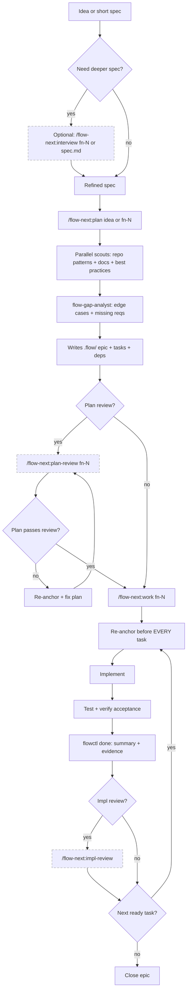

<div align="center">

# Flow-Next (OpenCode)

[](./CHANGELOG.md)
[](./CHANGELOG.md)

**Plan first, work second. OpenCode-native port of Flow-Next.**

**Upstream (Claude Code):** https://github.com/gmickel/gmickel-claude-marketplace/tree/main/plugins/flow-next

</div>

---

> **Experimental.** Active work-in-progress while we chase parity with upstream. **Ralph mode is now available (experimental).**

Ralph docs: `docs/ralph.md`

---

## What Is This?

Flow-Next is a plan-first orchestration system: epics, dependency-ordered tasks, re-anchoring, reviews, and audit trails. Everything lives in your repo. No external services. Uninstall by deleting `.flow/` (and `scripts/ralph/` if enabled).

This repo is a **native OpenCode port** of the original Claude Code plugin.

<table>
<tr>
<td></td>
<td></td>
</tr>
<tr>
<td align="center"><em>Planning: dependency-ordered tasks</em></td>
<td align="center"><em>Execution: fixes, evidence, review</em></td>
</tr>
</table>

---

## Epic-first Task Model

Flow-Next does not support standalone tasks. Every unit of work belongs to an epic `fn-N` (even if it’s a single task). Tasks are `fn-N.M` and inherit context from the epic spec.

Rationale: keeps the system simple, improves re-anchoring, and makes automation reliable.

---

## Why It Works

### You Control the Granularity

Work task-by-task with review after each, or run an entire epic at once. Same guarantees either way.

```bash
# One task at a time (review after each)
/flow-next:work fn-1.1

# Entire epic (review after all tasks complete)
/flow-next:work fn-1
```

### No Context Length Worries

* **Tasks sized at planning** so each fits one `/flow-next:work`
* **Re-anchor every task** from `.flow/` before any implementation
* **Survives compaction** because the source of truth is on disk

### Reviewer as Safety Net

If drift happens, a second model catches it before it compounds:

1. Implement task
2. Review via OpenCode or RepoPrompt
3. Fix → re-review until `<verdict>SHIP</verdict>`

### Zero Friction

* **Works in under a minute**: install, run a command
* **Non-invasive**: no daemons, no external services
* **Clean uninstall**: delete `.flow/` (and `scripts/ralph/` if enabled)

---

## Quick Start

### 1) Install (project-local)

From this repo:

```bash
./install.sh --project /path/to/your/project
```

Notes:
* Installs `.opencode/` into the project
* Only writes `.opencode/opencode.json` if the project doesn’t already have one

### 2) Setup

Open your project in OpenCode and run:

```bash
/flow-next:setup
```

This:
* Copies `flowctl` to `.flow/bin/`
* Adds flow-next instructions to `AGENTS.md`
* Creates `.flow/usage.md` CLI reference
* Tracks setup version for updates

After setup:

```bash
export PATH=".flow/bin:$PATH"
flowctl epics
flowctl tasks --epic fn-1
flowctl ready --epic fn-1
```

### 3) Use

```bash
/flow-next:plan Add a contact form with validation
/flow-next:work fn-1
```

### When to Use What

Flow-Next is flexible. There’s no single “correct” order — the right sequence depends on how well-defined your spec already is.

**The key question: How fleshed out is your idea?**

#### Vague idea or rough concept

```
Interview → Plan → Work
```

1. **Interview first** — `/flow-next:interview "your rough idea"` asks deep questions to surface requirements, edge cases, and decisions you haven’t thought about
2. **Plan** — `/flow-next:plan fn-1` researches best practices, current docs, repo patterns, then splits into properly-sized tasks
3. **Work** — `/flow-next:work fn-1` executes with re-anchoring and reviews

#### Well-written spec or PRD

```
Plan → Interview → Work
```

1. **Plan first** — `/flow-next:plan specs/my-feature.md` researches best practices and current patterns, then breaks your spec into epic + tasks
2. **Interview after** — `/flow-next:interview fn-1` runs deep questions against the plan to catch edge cases, missing requirements, or assumptions
3. **Work** — `/flow-next:work fn-1` executes

#### Minimal planning

```
Plan → Work
```

Skip interview entirely for well-understood changes. Plan still researches best practices and splits into tasks.

#### Quick single-task (spec already complete)

```
Work directly
```

```bash
/flow-next:work specs/small-fix.md
```

For small, self-contained changes where you already have a complete spec. Creates an epic with **one task** and executes immediately. You get flow tracking, re-anchoring, and optional review — without full planning overhead.

Best for: bug fixes, small features, well-scoped changes that don’t need task splitting.

**Note:** This does NOT split into multiple tasks. For detailed specs that need breakdown, use Plan first.

**Summary:**

| Starting point | Recommended sequence |
|----------------|---------------------|
| Vague idea, rough notes | Interview → Plan → Work |
| Detailed spec/PRD | Plan → Interview → Work |
| Well-understood, needs task splitting | Plan → Work |
| Small single-task, spec complete | Work directly (creates 1 epic + 1 task) |

You can always run interview again after planning to catch anything missed. Interview writes back to the spec, so iterations refine rather than replace.

---

## Human-in-the-Loop Workflow (Detailed)



---

## Commands

| Command | What It Does |
|---------|--------------|
| `/flow-next:plan <idea>` | Research codebase, create epic with dependency-ordered tasks |
| `/flow-next:work <id|file>` | Execute epic, task, or spec file, re-anchoring before each |
| `/flow-next:interview <id>` | Deep interview to flesh out a spec before planning |
| `/flow-next:plan-review <id>` | Carmack-level plan review via OpenCode or RepoPrompt |
| `/flow-next:impl-review` | Carmack-level impl review of current branch |
| `/flow-next:sync <id>` | Manually sync downstream specs after implementation drift |
| `/flow-next:ralph-init` | Scaffold repo-local Ralph harness ( `scripts/ralph/` ) |
| `/flow-next:setup` | Install flowctl locally + add docs |
| `/flow-next:uninstall` | Remove flow-next from project (keeps tasks if desired) |
| `/flow-next:export-context` | Export RepoPrompt context for external LLMs |

Work accepts an epic ( `fn-N` ), task ( `fn-N.M` ), or markdown spec file ( `.md` ). Spec files auto-create an epic with one task.

### Flags (skip questions)

```bash
/flow-next:plan Add caching --research=grep --no-review
/flow-next:plan Add auth --research=rp --review=rp

/flow-next:work fn-1 --branch=current --no-review
/flow-next:work fn-1 --branch=new --review=opencode

/flow-next:plan-review fn-1 --review=rp
/flow-next:impl-review --review=opencode
```

Natural language also works:

```bash
/flow-next:plan Add webhooks, use context-scout, skip review
/flow-next:work fn-1 current branch, no review
```

| Command | Available Flags |
|---------|-----------------|
| `/flow-next:plan` | `--research=rp|grep` , `--review=opencode|rp|export|none` , `--no-review` |
| `/flow-next:work` | `--branch=current|new|worktree` , `--review=opencode|rp|export|none` , `--no-review` |
| `/flow-next:plan-review` | `--review=opencode|rp|export` |
| `/flow-next:impl-review` | `--review=opencode|rp|export` |

---

## Features

### Re-anchoring prevents drift

Before EVERY task, Flow-Next re-reads:
* Epic spec and task spec from `.flow/`
* Current git status and recent commits
* Validation state

### Multi-user Safe

Teams can work in parallel branches without coordination servers:

* **Merge-safe IDs**: Scans existing files to allocate the next ID
* **Soft claims**: Tasks track an `assignee` field
* **Actor resolution**: Auto-detects from git email,  `FLOW_ACTOR` env, or `$USER`
* **Local validation**: `flowctl validate --all` catches issues before commit

### Zero Dependencies

Everything is bundled:
* `flowctl.py` ships with the plugin
* No external tracker CLI to install
* No external services
* Just Python 3

### Non-invasive

* No daemons
* No global config
* Delete `.flow/` to uninstall; if you enabled Ralph, also delete `scripts/ralph/`

### CI-ready

```bash
flowctl validate --all
```

### Fresh Context Per Task (Worker Agent)

When running `/flow-next:work` on an epic, each task spawns a dedicated worker subagent with fresh context. This prevents context bloat across large epics and ensures clean re-anchoring.

### Plan-Sync (Spec Drift Detection)

When implementation differs from spec (e.g., you planned `UserAuth.login()` but built `authService.authenticate()`), downstream tasks may reference stale APIs.

Plan-sync detects this drift and updates downstream specs:

```bash
# After completing a task, sync downstream specs
/flow-next:sync fn-1.1

# Or sync entire epic from most recent done task
/flow-next:sync fn-1

# Dry-run to see what would change
/flow-next:sync fn-1 --dry-run
```

Enable auto-sync after each task (optional):
```bash
flowctl config set planSync.enabled true
```

### Dependency Graphs

Tasks declare blockers; `flowctl ready` shows what can start. Nothing executes until dependencies resolve.

### One File Per Task

Each epic and task gets its own JSON + markdown pair. Merge conflicts are rare and easy to resolve.

### Cross-Model Reviews

Two models catch what one misses. Reviews use a second model (OpenCode or RepoPrompt) to verify plans and implementations before they ship.

**Review criteria:**

| Review Type | Criteria |
|-------------|----------|
| **Plan** | Completeness, Feasibility, Clarity, Architecture, Risks (incl. security), Scope, Testability |
| **Impl** | Correctness, Simplicity, DRY, Architecture, Edge Cases, Tests, Security |

Reviews block progress until `<verdict>SHIP</verdict>` . Fix → re-review cycles continue until approved.

#### OpenCode (Default)

OpenCode uses a dedicated review subagent configured in `.opencode/opencode.json` :
* `model: openai/gpt-5.2`
* `reasoningEffort: high`

Change those if you want a different model or effort.

#### RepoPrompt (Optional)

[RepoPrompt](https://repoprompt.com/?atp=KJbuL4) provides the best review experience on macOS.

**Why use RepoPrompt:**
* Best-in-class context builder for reviews (full file context, smart selection)
* Optional: enables the planning **context-scout** for deeper discovery vs repo-scout
* Visual diff review UI + persistent chat threads

**Setup:**

```bash
brew install --cask repoprompt
```

**Usage:**

```bash
/flow-next:plan-review fn-1 --review=rp
/flow-next:impl-review --review=rp
```

#### Configuration

Set default review backend:

```bash
# Per-project (saved in .flow/config.json)
flowctl config set review.backend opencode   # or rp, or none

# Per-session (environment variable)
export FLOW_REVIEW_BACKEND=opencode
```

Priority: `--review=...` argument > `FLOW_REVIEW_BACKEND` env > `.flow/config.json` > auto-detect.

#### Export (External LLM)

If you want to use an external model, run reviews with `--review=export` and use `/flow-next:export-context` to generate a clean prompt + file bundle for pasting into another tool.

---

## Memory System (Opt-in)

Persistent learnings that survive context compaction.

```bash
# Enable
flowctl config set memory.enabled true
flowctl memory init

# Manual entries
flowctl memory add --type pitfall "Always use flowctl rp wrappers"
flowctl memory add --type convention "Tests in __tests__ dirs"
flowctl memory add --type decision "SQLite over Postgres for simplicity"

# Query
flowctl memory list
flowctl memory search "flowctl"
flowctl memory read --type pitfalls
```

When enabled:
* **Planning**: `memory-scout` runs in parallel with other scouts
* **Work**: `memory-scout` retrieves relevant entries during re-anchor

Config lives in `.flow/config.json` , separate from Ralph’s `scripts/ralph/config.env` .

---

## Ralph (Autonomous Mode)

Ralph automation is available ( `/flow-next:ralph-init` ). Docs live at `docs/ralph.md` (setup, `config.env`, `.opencode/opencode.json`, logs).

### Controlling Ralph

```bash
flowctl status
flowctl ralph pause
flowctl ralph resume
flowctl ralph stop
```

Manual sentinels:
```bash
touch scripts/ralph/runs/<run-id>/PAUSE
rm scripts/ralph/runs/<run-id>/PAUSE
touch scripts/ralph/runs/<run-id>/STOP
```

---

## Task Completion

When a task completes, `flowctl done` appends structured data to the task spec:

### Done Summary

```markdown

## Done summary

- Added ContactForm component with Zod validation
- Integrated with server action for submission
- All tests passing

Follow-ups:
- Consider rate limiting (out of scope)
```

### Evidence

```markdown

## Evidence

- Commits: a3f21b9
- Tests: bun test
- PRs:
```

This creates a complete audit trail: what was planned, what was done, how it was verified.

---

## .flow/ Directory

```
.flow/
├── meta.json
├── config.json
├── epics/
│   └── fn-1-abc.json
├── specs/
│   └── fn-1-abc.md
├── tasks/
│   ├── fn-1-abc.1.json
│   ├── fn-1-abc.1.md
│   └── ...
└── memory/
    ├── pitfalls.md
    ├── conventions.md
    └── decisions.md
```

### ID Format

* **Epic**: `fn-N-xxx` where `xxx` is a 3-character alphanumeric suffix
* **Task**: `fn-N-xxx.M`

Legacy `fn-N` format is still supported for backwards compatibility.

---

## flowctl CLI

Bundled Python script for managing `.flow/`. Flow-Next’s commands handle epic/task creation automatically—use `flowctl` for direct inspection, fixes, or advanced workflows.

```bash
flowctl init
flowctl detect

flowctl epic create --title "..."
flowctl epic set-plan fn-1 --file spec.md
flowctl epic set-plan-review-status fn-1 --status ship
flowctl epic close fn-1

flowctl task create --epic fn-1 --title "..." --deps fn-1.2,fn-1.3 --priority 10
flowctl task set-description fn-1.1 --file desc.md
flowctl task set-acceptance fn-1.1 --file accept.md

flowctl dep add fn-1.3 fn-1.2

flowctl ready --epic fn-1
flowctl next
flowctl start fn-1.1
flowctl done fn-1.1 --summary-file s.md --evidence-json e.json
flowctl block fn-1.2 --reason-file r.md

flowctl show fn-1 --json
flowctl cat fn-1

flowctl validate --epic fn-1
flowctl validate --all

flowctl review-backend            # Get configured review backend (ASK if not set)
flowctl config set review.backend opencode  # Set default backend
```

📖 **[Full CLI reference](docs/flowctl.md)**

---

## Troubleshooting

### Reset a stuck task

```bash
flowctl show fn-1.2 --json | jq '.status'
flowctl task set fn-1.2 --status pending
```

### Clean up `.flow/`

```bash
rm -rf .flow/
flowctl init
```

---

## Requirements

* Python 3.8+
* git
* Optional: [RepoPrompt](https://repoprompt.com/?atp=KJbuL4) for macOS GUI reviews + its context builder (also powers the planning context-scout). OpenCode reviews work without it.

---

## Uninstall

```bash
rm -rf .flow/               # Core flow state
rm -rf scripts/ralph/       # Ralph (if enabled)
```

---

<div align="center">

Made by [Gordon Mickel](https://mickel.tech) · [@gmickel](https://twitter.com/gmickel)

</div>
