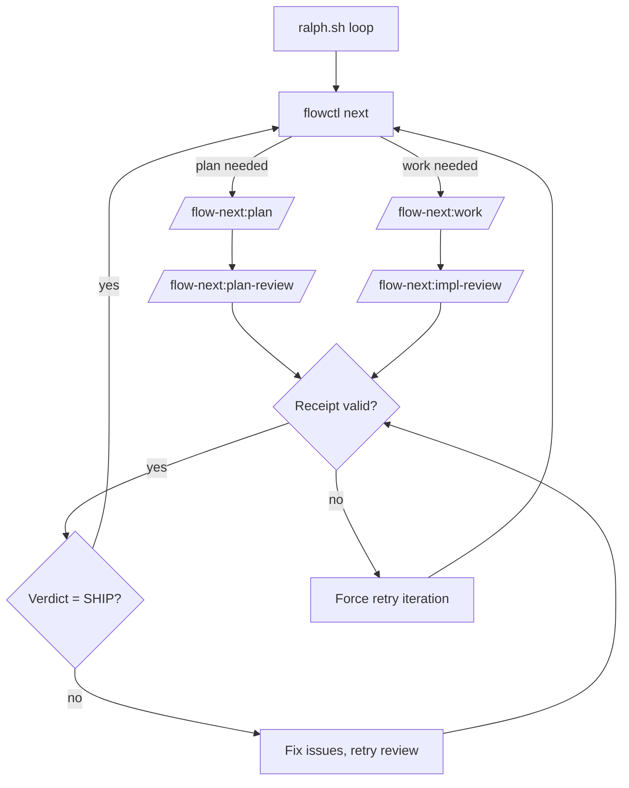

# Ralph (Autonomous Loop)

Ralph is Flow-Next's repo-local autonomous harness. It loops over tasks, applies multi-model review gates, and produces production-quality code overnight.

---

## Quick Start

### Step 1: Setup (inside OpenCode)

Run the init skill from OpenCode:

```bash
/flow-next:ralph-init
```

Or run setup from terminal without entering OpenCode:

```bash
opencode run "/flow-next:ralph-init"
```

This scaffolds `scripts/ralph/` with:
- `ralph.sh` — main loop
- `ralph_once.sh` — single iteration (for testing)
- `config.env` — all settings
- `runs/` — artifacts and logs

### Step 1.5: Configure (edit config.env)

Before running, set your review backends in `scripts/ralph/config.env`:

```bash
PLAN_REVIEW=opencode   # or: rp, none
WORK_REVIEW=opencode   # or: rp, none
```

See [Configuration](#configuration) for all options.

### Step 1.75: Test First (Recommended)

```bash
scripts/ralph/ralph_once.sh
```

Runs ONE iteration then exits. Observe the output before committing to a full run.

### Step 2: Run (outside OpenCode)

```bash
scripts/ralph/ralph.sh
```

Ralph spawns OpenCode runs via `opencode run`, loops until done, and applies review gates.

**Watch mode** - see what's happening in real-time:
```bash
scripts/ralph/ralph.sh --watch           # Stream tool calls
scripts/ralph/ralph.sh --watch verbose   # Also stream model responses
```

### Step 2.5: Monitor with TUI (Optional)

```bash
# Install TUI (requires Bun)
bun add -g @gmickel/flow-next-tui

# Start TUI (auto-selects latest run)
flow-next-tui
```

Real-time visibility into task progress, streaming logs, and run state.


See [flow-next-tui README](../../../flow-next-tui/README.md).

### Step 3: Uninstall

```bash
rm -rf scripts/ralph/
```

---

## How It Works

Ralph wraps OpenCode in a shell loop with quality gates:

```
┌─────────────────────────────────────────────────────────┐
│  scripts/ralph/ralph.sh                                 │
│  ┌──────────────────────────────────────────────────┐   │
│  │ while flowctl next returns work:                 │   │
│  │   1. opencode run "/flow-next:plan" or :work     │   │
│  │   2. check review receipts                       │   │
│  │   3. if missing/invalid → retry                  │   │
│  │   4. if SHIP verdict → next task                 │   │
│  └──────────────────────────────────────────────────┘   │
└─────────────────────────────────────────────────────────┘
```



---

## Why Flow-Next Ralph vs Anthropic's ralph-wiggum?

Anthropic's official ralph-wiggum plugin uses a Stop hook to keep Claude in the same session. Flow-Next inverts this architecture for production-grade reliability.

| Aspect | ralph-wiggum | Flow-Next Ralph |
|--------|--------------|-----------------|
| **Session model** | Single session, accumulating context | Fresh context per iteration |
| **Loop mechanism** | Stop hook re-feeds prompt in SAME session | External bash loop, new `opencode run` each iteration |
| **Context management** | Transcript grows, context fills up | Clean slate every time |
| **Failed attempts** | Pollute future iterations | Gone with the session |
| **Re-anchoring** | None | Re-reads epic/task spec EVERY iteration |
| **Quality gates** | None (test-based only) | Multi-model reviews block until SHIP |
| **Stuck detection** | `--max-iterations` safety limit | Auto-blocks task after N failures |
| **State storage** | In-memory transcript | File I/O (`.flow/`, receipts, evidence) |
| **Auditability** | Session transcript | Per-iteration logs + receipts + evidence |

**The Core Problem with ralph-wiggum**

1. **Context pollution** - Every failed attempt stays in context, potentially misleading future iterations
2. **No re-anchoring** - As context fills, the model loses sight of the original task spec
3. **Single model** - No external validation; the model grades its own homework
4. **Binary outcome** - Either completion promise triggers, or you hit max iterations

**Flow-Next's Solution**

Fresh context every iteration + multi-model review gates + receipt-based proof-of-work.

Two models catch what one misses. Process failures, not model failures.

---

## Quality Gates

Ralph enforces quality through three mechanisms:

### 1. Multi-Model Reviews

Reviews use a second model to verify code. Two models catch what one misses.

**Review backends:**
- `opencode` — OpenCode reviewer subagent (default)
- `rp` — [RepoPrompt](https://repoprompt.com/?atp=KJbuL4) (macOS only, GUI-based)
- `none` — skip reviews (not recommended for production)

**We recommend RepoPrompt** when available. Its Builder provides full file context with intelligent selection. OpenCode reviews are zero-install and use your configured model and effort.

- Plan reviews verify architecture and edge cases before coding starts
- Impl reviews verify the implementation meets spec after each task

### 2. Receipt-Based Gating

Every review must produce a receipt JSON proving it ran:

```json
{"type":"impl_review","id":"fn-1.1","mode":"opencode","timestamp":"2026-01-09T..."}
```

No receipt = no progress. Ralph retries until receipt exists.

This is the same at-least-once delivery protocol used in distributed systems. Treats the agent as an untrusted actor; receipts are proof-of-work.

### 3. Review Loops Until SHIP

Reviews don't just flag issues—they block progress. The cycle repeats until:

```
<verdict>SHIP</verdict>
```

Fix -> re-review -> fix -> re-review... until the reviewer approves.

#### Verdict Format

Reviews MUST return XML verdict tags:
- `<verdict>SHIP</verdict>` - approved, proceed to next task
- `<verdict>NEEDS_WORK</verdict>` - fix issues, re-review in same chat
- `<verdict>MAJOR_RETHINK</verdict>` - fundamental problems, blocks progress

**Common failures:**
- Plain text "SHIP" or "Approved" -> review skill wasn't used correctly
- Interactive prompt (a/b/c) -> review backend misconfigured
- No verdict in response -> check iteration log for errors

### 4. Memory Capture (Opt-in)

When memory is enabled (`flowctl config set memory.enabled true`), NEEDS_WORK reviews auto-capture learnings to `.flow/memory/pitfalls.md`.

This builds a project-specific knowledge base of things reviewers catch that models tend to miss.

**Note**: Memory config lives in `.flow/config.json`, separate from Ralph's `scripts/ralph/config.env`. Memory is a flow-next feature that works in both manual and Ralph modes.

---

## Configuration

Edit `scripts/ralph/config.env`:

### Review Settings

| Variable | Values | Description |
|----------|--------|-------------|
| `PLAN_REVIEW` | `opencode`, `rp`, `none` | How to review plans |
| `WORK_REVIEW` | `opencode`, `rp`, `none` | How to review implementations |
| `REQUIRE_PLAN_REVIEW` | `1`, `0` | Block work until plan review passes |

- `opencode` — OpenCode reviewer subagent (default)
- `rp` — RepoPrompt (macOS, requires GUI)
- `none` — skip reviews

### Branch Settings

| Variable | Values | Description |
|----------|--------|-------------|
| `BRANCH_MODE` | `new`, `current`, `worktree` | How to handle git branches |

- `new` — create one branch for the entire Ralph run (`ralph-<run-id>`)
- `current` — work on current branch
- `worktree` — use git worktrees (advanced)

With `BRANCH_MODE=new`, all epics work on the same run branch. Commits are prefixed with task IDs (e.g., `feat(fn-1.1): ...`) for easy identification. This enables cherry-picking or reverting individual epics post-run.

### Limits

| Variable | Default | Description |
|----------|---------|-------------|
| `MAX_ITERATIONS` | `25` | Total loop iterations |
| `MAX_ATTEMPTS_PER_TASK` | `5` | Retries before auto-blocking task |

### Scope

| Variable | Example | Description |
|----------|---------|-------------|
| `EPICS` | `fn-1,fn-2` | Limit to specific epics (empty = all) |

### Permissions

| Variable | Default | Effect |
|----------|---------|--------|
| `YOLO` | `1` | Sets `OPENCODE_PERMISSION='{\"*\":\"allow\"}'` for unattended runs |

Note: OpenCode still enforces permissions in headless runs. `YOLO=1` (the default) is required for truly unattended loops. Set `YOLO=0` for interactive testing.

### Display

| Variable | Default | Description |
|----------|---------|-------------|
| `RALPH_UI` | `1` | Colored/emoji output (0 = plain) |

### OpenCode settings

| Variable | Example | Description |
|----------|---------|-------------|
| `FLOW_RALPH_OPENCODE_MODEL` | `openai/gpt-5.2` | Override model for Ralph runs |
| `FLOW_RALPH_OPENCODE_VARIANT` | `high` | Provider-specific variant/effort |
| `FLOW_RALPH_OPENCODE_AGENT` | `ralph-runner` | Subagent name to run |
| `FLOW_RALPH_REVIEWER_AGENT` | `opencode-reviewer` | Reviewer subagent name |
| `OPENCODE_BIN` | `/usr/local/bin/opencode` | Override OpenCode CLI path |

**Default template (current):**
```
FLOW_RALPH_OPENCODE_MODEL=openai/gpt-5.2-codex
FLOW_RALPH_OPENCODE_VARIANT=medium
```

---

## Run Artifacts

Each run creates:

```
scripts/ralph/runs/<run-id>/
  ├── iter-001.log          # Raw OpenCode output
  ├── iter-002.log
  ├── progress.txt          # Append-only run log
  ├── attempts.json         # Per-task retry counts
  ├── branches.json         # Run branch info (base_branch, run_branch)
  ├── receipts/
  │   ├── plan-fn-1.json    # Plan review receipt
  │   └── impl-fn-1.1.json  # Impl review receipt
  └── block-fn-1.2.md       # Written when task exceeds MAX_ATTEMPTS
```

---

## RepoPrompt Integration

When `PLAN_REVIEW=rp` or `WORK_REVIEW=rp`, Ralph uses `flowctl rp` wrappers:

```bash
flowctl rp pick-window --repo-root .  # Find window by repo
flowctl rp builder ...                 # Build context
flowctl rp chat-send ...               # Send to reviewer
```

Never call `rp-cli` directly in Ralph mode.

**Window selection** is automatic by repo root. RepoPrompt must have a window open on your project.

---

## OpenCode Integration

When `PLAN_REVIEW=opencode` or `WORK_REVIEW=opencode`, Ralph uses the OpenCode reviewer subagent via:

```bash
/flow-next:plan-review <fn-N> --review=opencode
/flow-next:impl-review <fn-N.M> --review=opencode
```

**Requirements:**
- OpenCode CLI installed and available as `opencode`
- Reviewer agent configured in `.opencode/opencode.json` (default: `opencode-reviewer`)

**Model:** Configured in `.opencode/opencode.json` (default `openai/gpt-5.2` with `reasoningEffort=high`). For Ralph runs you can override with:

```bash
FLOW_RALPH_OPENCODE_MODEL=openai/gpt-5.2
FLOW_RALPH_OPENCODE_VARIANT=high
```

**Session continuity:** OpenCode reviews are stateless per iteration; each re-review is a fresh subagent run. Receipts must be written each time.

---

## Troubleshooting

### Plan gate loops / retries

- Check receipt exists: `ls scripts/ralph/runs/*/receipts/plan-*.json`
- Verify type/id match expected epic
- Inspect logs: `cat scripts/ralph/runs/*/iter-*.log`

### Impl gate loops / retries

- Check receipt exists: `ls scripts/ralph/runs/*/receipts/impl-*.json`
- Gate only passes when verdict is `<verdict>SHIP</verdict>`
- Check progress: `cat scripts/ralph/runs/*/progress.txt`

### Auto-blocked tasks

After `MAX_ATTEMPTS_PER_TASK` failures, Ralph:
1. Writes `block-<task>.md` with failure context
2. Marks task blocked via `flowctl block`
3. Moves to next task

### RepoPrompt not found

Ensure rp-cli is installed and RepoPrompt window is open on your repo.

Alternatives:
- Use OpenCode instead: set `PLAN_REVIEW=opencode` and `WORK_REVIEW=opencode`
- Skip reviews: set `PLAN_REVIEW=none` and `WORK_REVIEW=none`

### OpenCode not found

Ensure OpenCode CLI is installed and available in PATH:

```bash
opencode --help
```

Or switch to RepoPrompt: set `PLAN_REVIEW=rp` and `WORK_REVIEW=rp`.

---

## Testing Ralph

### Single iteration (observe before committing)

```bash
scripts/ralph/ralph_once.sh
```

Runs one loop iteration, then exits. Good for verifying setup.

### Watch mode

```bash
scripts/ralph/ralph.sh --watch           # Stream tool calls in real-time
scripts/ralph/ralph.sh --watch verbose   # Also stream model responses
```

Watch mode shows you what OpenCode is doing without blocking autonomy. Tool calls display with icons and colors. Logs still captured to `runs/<run>/iter-*.log`.

### Verbose logging

```bash
FLOW_RALPH_VERBOSE=1 scripts/ralph/ralph.sh
```

Appends detailed logs to `scripts/ralph/runs/<run>/ralph.log`.

### Debug environment variables

```bash
FLOW_RALPH_OPENCODE_MODEL=openai/gpt-5.2
FLOW_RALPH_OPENCODE_VARIANT=high
FLOW_RALPH_OPENCODE_AGENT=ralph-runner
OPENCODE_BIN=/path/to/opencode
```

---

## Guard Hooks

Ralph includes plugin hooks that enforce workflow rules deterministically.

**Only active when `FLOW_RALPH=1`** — non-Ralph users see zero overhead.

### What hooks enforce

| Rule | Why |
|------|-----|
| No `--json` on chat-send | Preserves review text output (rp) |
| No `--new-chat` on re-reviews | First review creates chat, subsequent stay in same (rp) |
| Require `flowctl done` summary+evidence | Enforces audit trail for impl tasks |
| Receipt must exist before completion | Blocks progress without review proof |
| Track OpenCode review verdicts | Validates review completed successfully |
| Block direct `rp-cli` | Enforce wrapper usage for consistency |

### Hook location

```
.opencode/plugin/
  flow-next-ralph-guard.ts  # OpenCode hook logic
```

### Disabling hooks

Temporarily: unset `FLOW_RALPH`.

Permanently: delete `.opencode/plugin/flow-next-ralph-guard.ts`.

---

## Morning Review Workflow

After Ralph completes overnight, here's how to review and merge the work.

### 0. Check run completion

```bash
# Did Ralph finish?
cat scripts/ralph/runs/*/progress.txt | tail -5

# Any blocked tasks?
ls scripts/ralph/runs/*/block-*.md 2>/dev/null

# Tasks still pending?
flowctl ready --json
```

If run is partial: review `block-*.md` files, fix issues, re-run `ralph.sh` (resumes from pending tasks).

### 1. Check what happened

```bash
cat scripts/ralph/runs/*/progress.txt   # run summary
ls scripts/ralph/runs/*/receipts/       # all reviews passed
git log --oneline                        # all commits
```

### 2. Review commits by epic

Commits include task IDs (e.g., `feat(fn-1.1): ...` or `... (fn-2.1)`):

```bash
git log --oneline --grep="fn-1"   # all fn-1 commits
git log --oneline --grep="fn-2"   # all fn-2 commits
```

### 3. If everything looks good

```bash
git checkout main
git merge ralph-<run-id>
# or create PR: gh pr create
```

### 4. If one epic is bad

**Option A: Cherry-pick good epics**

```bash
git checkout main
git cherry-pick <fn-1-commits>
git cherry-pick <fn-2-commits>
# skip fn-3
git cherry-pick <fn-4-commits>
```

**Option B: Revert bad epic, merge rest**

```bash
git checkout ralph-<run-id>
git revert <fn-3-commits>
git checkout main
git merge ralph-<run-id>
```

### 5. Finding commit SHAs

Use `git log --grep` or check task evidence:

```bash
flowctl show fn-1.1 --json | jq '.evidence.commits'
```

---

## References

- [flowctl CLI reference](flowctl.md)
- [Flow-Next README](../README.md)
- Test scripts:
  - Full: `plugins/flow-next/scripts/ralph_e2e_rp_test.sh`
  - Short (2 tasks): `plugins/flow-next/scripts/ralph_e2e_short_rp_test.sh`
